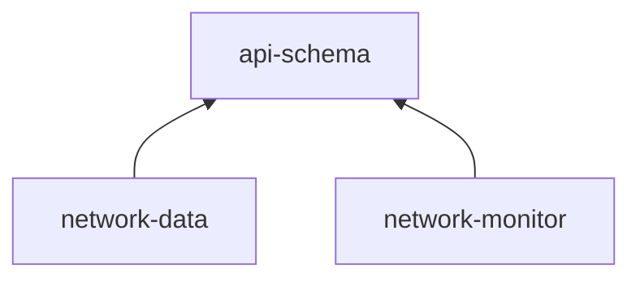

# network-station-coverage

This monorepository consists of three related projects that ensamble a system dedicated to determine the networkspeed available to certain devices within a network of stations.

## system architecture



### package: api-schema

This package contains the api contract that is respected by both applications of this system. The Schemas are defined according to the OpenApi Specification Version 3.

The synchronization model and the information model this system conforms to are defined within this package.

### application: network-monitor

This application serves as a web client that represents the use case to determine the network speed that can be provided to a certain device within a system of network stations.

### application: network-data

This application serves to provide a rest api that serves network associated data like the participating network stations and devices.

## project setup

### prerequisites

This project uses yarn as a dependecy manager. If you don't have yarn setup on your system follow [these instructions](https://docs.npmjs.com/downloading-and-installing-node-js-and-npm). Then open a terminal and execute the following command.

```bash
sudo npm install -g yarn
```

### install dependecies

To install the dependecies of this project open a terminal and execute the following command.

```bash
yarn
```

### build projects

To build the applications that compose the network coverage system open a terminal and execute the following command.

```bash
yarn build
```

### start the system

Multiple scripts start the system, each is dedicated to a certain stage or environment.

#### environment: mock

This environment serves to develop the network-monitor application in isolation. To start the application without a runnin network-data service execute the following command.

```bash
yarn start:mock
```

#### environment: development

This environment serves to develop the system running on your local machine. To start the network-station-coverage service execute the following command.

```bash
yarn start:dev
```

## quality goals

The main quality attribute respected throughout the development of this project was maintainability. To achieve this the following aspects were considered.

### aspect: testing

To ensure the system behaves as intended a test coverage of 90% is enforced and watched by the ci pipeline of this project. Additionally the feature development follows an api first approach to ensure the api's are testable.

### aspect: documentation

#### application: network-data

The network-data service provides a swagger-ui endpoint available at route '/docs'.

#### application: network-monitor

A storybook is setup for the network-monitor application that serves as a documentation for the ui components maintained within the network-monitor project. To start the storybook run the following commands.

```bash
yarn build:storybook
```


```bash
yarn start:storybook
```
